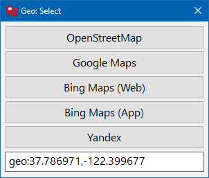

# Geo Uri Select

A Windows application that allows you choose where to open [`geo:`](https://en.wikipedia.org/wiki/Geo_URI_scheme) and [`bingmaps:`](https://docs.microsoft.com/en-us/windows/uwp/launch-resume/launch-maps-app) URIs. 

Some applications hardcode their location functionality to `bingmaps:` URIs, which would *always* open the Windows 10 Bing Maps application. I don't like the Bing Maps application, so I made this small tool to navigate around the issue by adding a quick way to instead open the default browser.

Map providers currently include:
- OpenStreetMap
- Google Maps
- Bing Maps
- Bing Maps Windows 10 App
- Yandex



## Installation

Copy `geo-url-select.exe` to `C:\Program Files\GeoUrlSelect\geo-url-select.exe`. 

Then run `register_url_handler.reg` to create the necessary registry keys, so that you can select the program from the Windows 10 Default Programs settings dialogue.

If you want to place the .exe in another location, update the path in the .reg file accordingly (or directly in the registry).

## Building

You can build the project by running the following command:

```
cargo build --release
```

## TODO

Caveats:
- I'm a Rust novice, the code lacks any meaningful error handling
- The application works on Windows 10+ only (if you ditch the Bing Maps App button, it could probably work in earlier versions, but this is untested)
- Inconsistent use of `uri` and `url`
- No (persistent or any) settings

Possible further work:
- "Copy to clipboard" function
- Exit application after click, with setting
- A proper automated setup
- A nicer icon

## Resources

Registering a Windows URL handler:
- https://jorgen.tjer.no/post/2021/03/13/registering-a-rust-program-as-a-browser-on-windows/
- https://github.com/jorgenpt/bichrome/blob/04e8a4476105501032121c05f487f592c6ca68ce/src/windows.rs#L53
- https://docs.microsoft.com/en-us/windows/uwp/launch-resume/handle-uri-activation
- https://superuser.com/questions/1049803/register-custom-uri-scheme-handler-in-windows-10

Creating Windows GUIs with Rust:
- https://gabdube.github.io/native-windows-gui/native-windows-docs/getting_started.html
